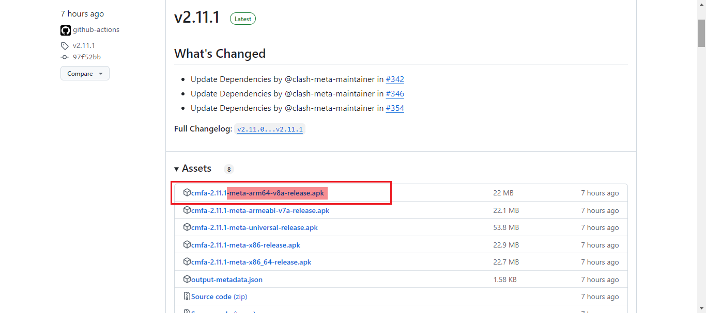
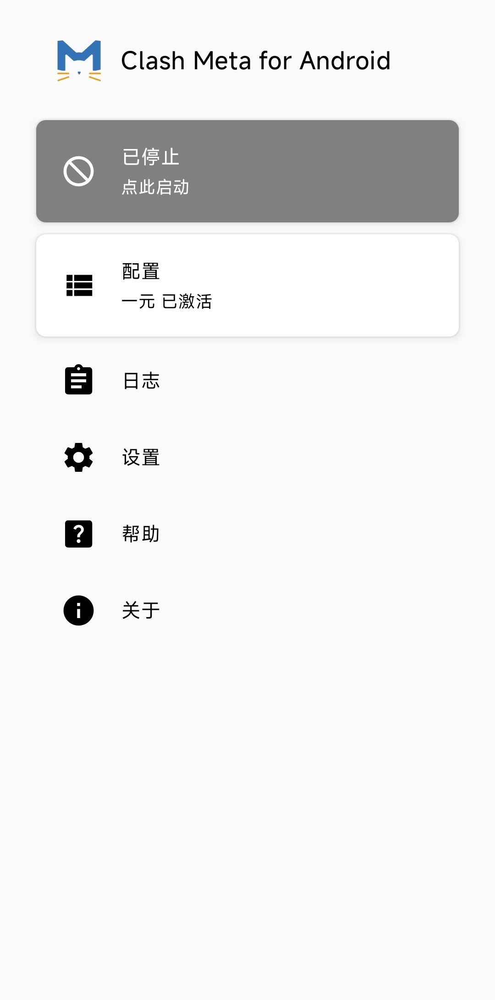
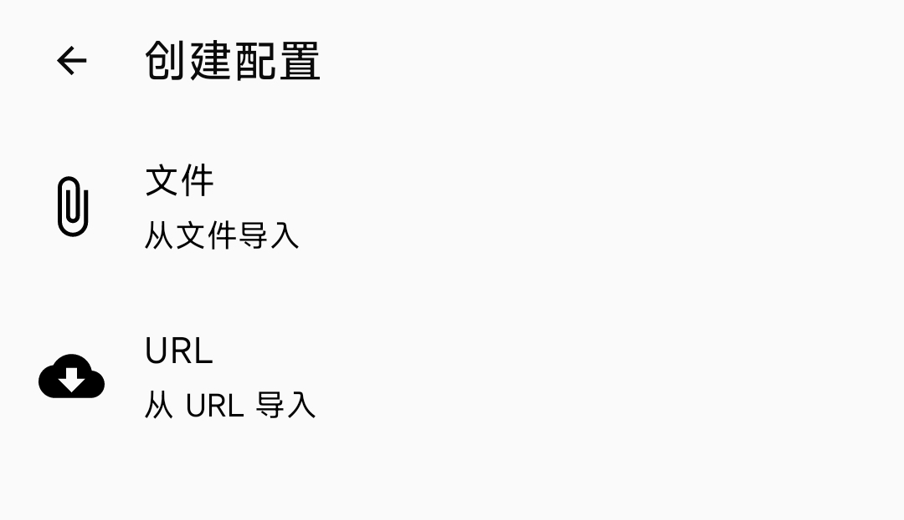
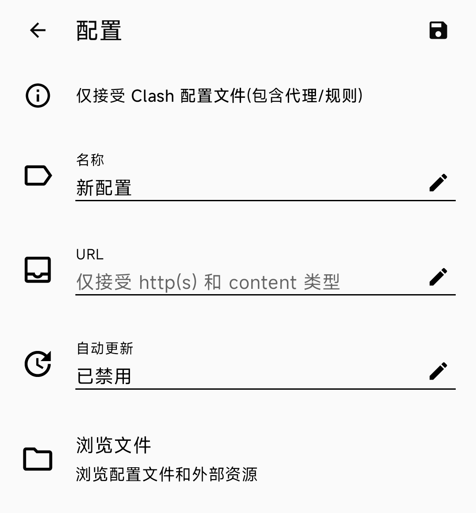
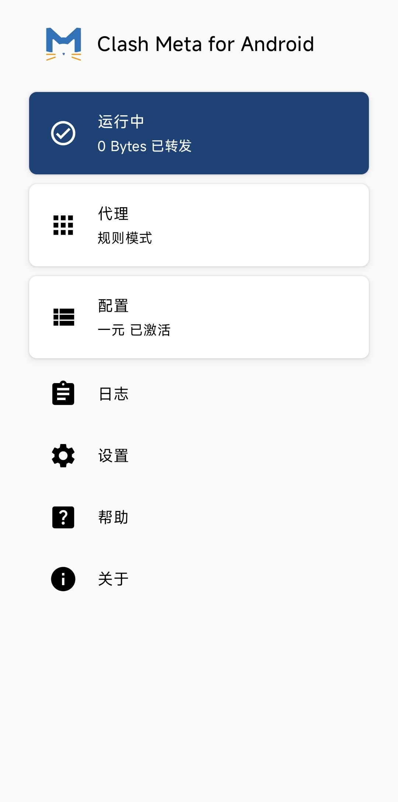

# Two Zero Three 内部教程

经过最近几天的讲述，相信你们已经懂了我所讲的相关内容。我将在本文中告诉你们如何使用 **Clash Meta For Android** 这个安卓软件。

**免责声明：如果你要根据本教程安装这个软件，即表示你不会用它发表违法违规内容，即使发表也与我无关。你所看到的所有东西都是你直接或间接找到的，无论阅读或观看或传播，本人不负责任。**

## 安装

请访问 https://github.com/MetaCubeX/ClashMetaForAndroid/releases

然后你将看到这个项目的发行版，排在最前的是最新版，你需要找到符合你的手机系统的版本，我一般选择后缀是 `-meta-arm64-v8a-release.apk` 的文件，请点击下载。下方的图片点击可以放大。

然后根据你的手机的安装过程正常安装。如果安装失败，请重新下载正确的软件版本。

## 添加订阅

打开软件，你应该直接看到这个界面。

点击 **“配置”** 按钮，然后你将看到以下界面。已有的两个列表项是我先前添加的，不必在意。

点击右上角加号：

点击 **“从URL导入”**。

名称可以随意填写，URL需要填写由你选择的服务商提供的地址。如果是会自动更新的文件，则点击“自动更新”下面的横线，然后根据指示填写自动更新时间，该软件将会每隔一段时间更新配置文件。最后一个“浏览文件”不必在意。

完成后，点击右上角保存。

## 打开代理开关

返回到软件主界面，点击 **“已停止 点此启动”** 按钮。

然后你就可以访问[Google搜索](https://www.google.com/)，以及隔壁李艳某先生所说的各种网站了。

## 注意

> 更多内容，请找我本人继续了解。

该软件的默认代理方式即代理全部软件，也即是说，你如果在某些国内网站发布视频或评论，IP属地将显示某个海外地址。